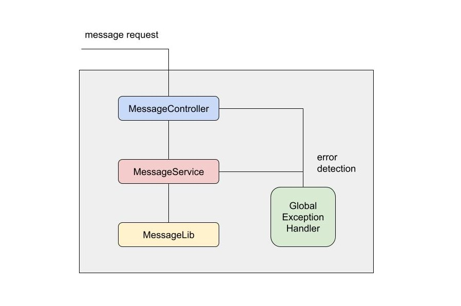

## Layered Architecture Demo

This is a sample application aiming to demonstrate multilayer interactions in Java programming. It maintains a list of dummy messages subsequent to every external request. Each message is categorized by a unique ID as a reference for users to retrieve one or multiple messages.

### System Architecture


### Prerequisites
- JDK 1.8
- Maven 3.6.x or above

### Build and Run

- #### Build Project
```
mvn clean install
```

- #### Build Project and skip tests
```
mvn clean install -Dmaven.test.skip
```

- #### Start Application
```
mvn spring-boot:run
```

- #### Run Unit Test
```
mvn test
```

### REST API
Exposed port: 8085

- #### Get all messages
###### HTTP Type: GET
###### Endpoint: /msg
###### Request Body: N/A
###### Response Body:
```json
[
    {
        "id": 0,
        "data": [
            "object0",
            "object1",
            "object2"
        ],
        "message": "message0"
    },
    {
        "id": 1,
        "data": [
            "object3",
            "object4",
            "object5"
        ],
        "message": "message1"
    }
]
```
###### Response Code: 200 OK; 500 Internal Server Error

- #### Get message by ID
###### HTTP Type: GET
###### Endpoint: /msg/{id}
###### Request Body: N/A
###### Response Body:
```json
{
    "id": 0,
    "data": [
        "object0",
        "object1",
        "object2"
    ],
    "message": "message0"
}
```
###### Response Code: 200 OK; 404 Not Found; 500 Internal Server Error

- #### Create a new message
###### HTTP Type: POST
###### Endpoint: /msg
###### Request Body:
```json
{
    "id": 0,
    "data": [
        "object0",
        "object1",
        "object2"
    ],
    "message": "message0"
}
```
###### Response Body: N/A
###### Response Code: 201 Created; 500 Internal Server Error

- #### Update multiple existing messages
###### HTTP Type: PUT
###### Endpoint: /msg
###### Request Body:
```json
[
    {
        "id": 0,
        "data": [
            "object0",
            "object1",
            "object2"
        ],
        "message": "message0"
    },
    {
        "id": 1,
        "data": [
            "object3",
            "object4",
            "object5"
        ],
        "message": "message1"
    }
]
```
###### Response Body: N/A
###### Response Code: 200 OK; 500 Internal Server Error

- #### Delete an existing message
###### HTTP Type: DELETE
###### Endpoint: /msg/{id}
###### Request Body: N/A
###### Response Body: N/A
###### Response Code: 200 OK; 404 Not Found; 500 Internal Server Error

- #### Clear all messages
###### HTTP Type: DELETE
###### Endpoint: /msg
###### Request Body: N/A
###### Response Body: N/A
###### Response Code: 200 OK; 500 Internal Server Error


